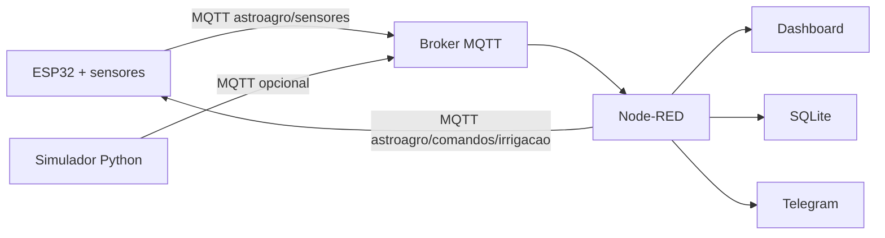

# AstroAgro Sentinel

Projeto IoT fictício para a Global Solution 2026.1: **Soluções Inteligentes de IA para a Nova Economia Espacial**.

O AstroAgro Sentinel integra sensores locais em uma fazenda com uma plataforma IoT inspirada por dados espaciais. O ESP32 coleta condições do solo e do ambiente, envia telemetria por MQTT, recebe comandos remotos de irrigação, registra histórico em banco de dados, exibe um dashboard e dispara alertas externos quando há risco operacional ou climático.

## Integrantes

- Lucca Phelipe Masini (RM 564121)
- Igor Paixão Sarak (RM 563726)
- Bernardo Braga Perobeli (RM 562468)

## Ideia central

Satélites conseguem indicar risco regional de seca, calor ou baixa produtividade, mas a decisão no campo depende de dados locais. Este protótipo simula essa integração com um **índice orbital** fictício e medições reais ou simuladas de sensores IoT.

## Arquitetura



## Entregáveis incluídos

- `firmware/astroagro_sentinel_esp32/astroagro_sentinel_esp32.ino`: firmware do ESP32.
- `node-red/astroagro-flow.json`: fluxo Node-RED importável.
- `database/schema.sql`: schema SQLite para armazenamento.
- `simulator/astroagro_simulator.py`: simulador de telemetria e banco local.
- `docs/demonstracao.md`: passo a passo para demonstrar a solução.
- `docs/roteiro-pitch.md`: roteiro de pitch de até 5 minutos.

## Hardware sugerido

- ESP32 DevKit.
- DHT22 para temperatura e umidade do ar.
- Sensor capacitivo de umidade do solo.
- LDR para luminosidade.
- Sensor analógico de nível de reservatório ou potenciômetro para simulação.
- Relé 5V ou LED para simular bomba de irrigação.
- LED vermelho ou buzzer para alerta local.

## Tópicos MQTT

| Tópico | Direção | Uso |
| --- | --- | --- |
| `astroagro/sensores` | ESP32/simulador -> plataforma | Telemetria em JSON |
| `astroagro/status` | ESP32 -> plataforma | Estado do dispositivo |
| `astroagro/comandos/irrigacao` | plataforma -> ESP32 | Comandos `ON` e `OFF` |
| `astroagro/alertas` | plataforma -> broker | Alertas classificados |

## Formato de telemetria

```json
{
  "device_id": "astroagro-esp32-01",
  "soil_moisture": 41.2,
  "air_temperature": 29.5,
  "air_humidity": 64.0,
  "luminosity": 72.0,
  "water_level": 58.0,
  "flow_detected": true,
  "irrigation_active": false,
  "orbital_index": 0.62,
  "sequence": 15
}
```

## Regras implementadas

- Estado **Normal**: solo e temperatura em faixa aceitável.
- Estado **Atenção**: solo abaixo do ideal ou temperatura elevada.
- Estado **Crítico**: solo muito seco, temperatura alta e luminosidade alta.
- Estado **Irrigação Ativa**: relé/bomba acionado manualmente ou automaticamente.
- Estado **Falha Operacional**: irrigação ligada sem fluxo detectado ou reservatório baixo.

O **Índice AstroAgro de Risco** usa uma pontuação entre 0 e 100 com base em umidade do solo, temperatura, luminosidade, tendência das últimas leituras e índice orbital simulado.

## Como executar a demonstração

1. Instale e execute um broker MQTT, como Mosquitto, ou use HiveMQ Cloud.
2. No Node-RED, instale os pacotes:
   - `node-red-dashboard`
   - `node-red-node-sqlite`
3. Crie o banco com `database/schema.sql`.
4. Importe `node-red/astroagro-flow.json`.
5. Configure o broker MQTT no Node-RED.
6. Opcionalmente, configure as variáveis de ambiente:
   - `TELEGRAM_BOT_TOKEN`
   - `TELEGRAM_CHAT_ID`
7. Grave o firmware no ESP32 ou rode o simulador Python.

Para simular sem hardware:

```powershell
python .\simulator\astroagro_simulator.py --sqlite .\database\astroagro.db
```

Com MQTT:

```powershell
python .\simulator\astroagro_simulator.py --mqtt-host localhost
```

## Observação

Este projeto é um protótipo acadêmico. O índice orbital é fictício, mas representa como dados de satélite poderiam complementar medições locais em uma aplicação real de agricultura sustentável.
