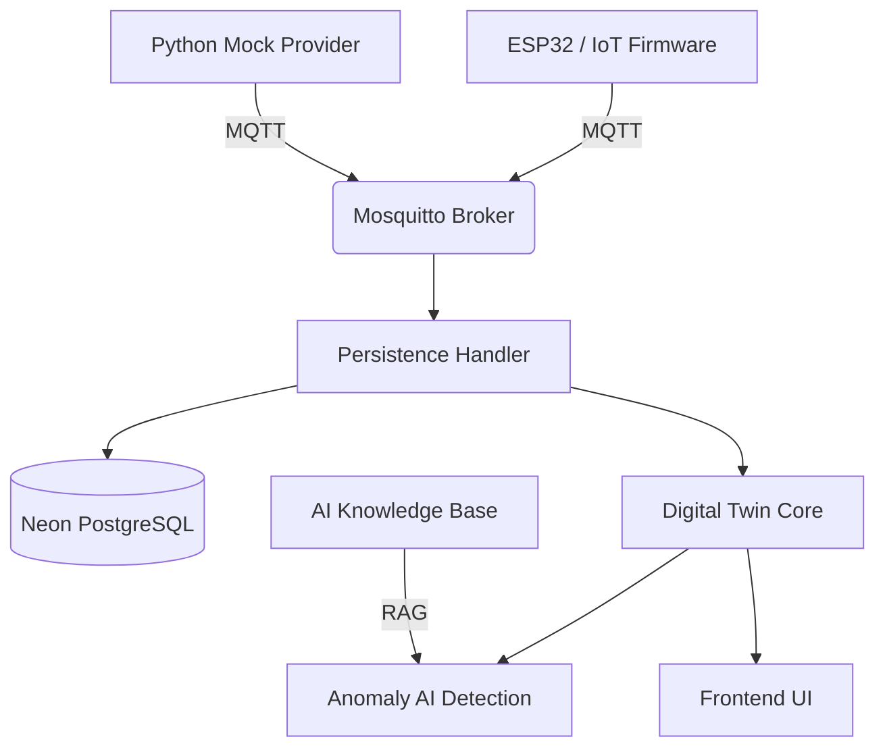

# ⚡ Digital Twin Platform | Industrial Intelligence

Projeto de **Gêmeo Digital (Digital Twin)** e monitoramento preditivo para equipamentos industriais. Este repositório funciona como um template genérico (zero-hardcode) desenhado para ser agnóstico de hardware e adaptável a qualquer ecossistema industrial. O sistema conecta telemetria IoT de chão de fábrica a um monitoramento de alta fidelidade e IA para predição de falhas.

---

## 🏗️ Arquitetura do Sistema

O ecossistema utiliza uma arquitetura baseada em eventos (EDA) e princípios de **Clean Architecture** para garantir agnosticismo e escalabilidade.



---

## 📂 Organização do Projeto

O repositório é estruturado de forma modular, permitindo a transição futura de um monólito para microsserviços independentes. O sistema é 100% orientado a configurações e profiles isolados do código.

### 1. `/config` (Ponto de Customização)
A única pasta que deve ser editada para implantar o sistema.
*   **`system.json`**: Define o branding, o nome do sistema e os prefixos de comunicação.

### 2. `/backend` (Cérebro do Sistema)
Dividido em aplicações independentes que compartilham infraestrutura, lendo 100% de `/config`:
*   **`apps/digital_twin_core`**: Lógica de integração central e websocket de telemetria.
*   **`apps/rpa_agent`**: Novo módulo de automação RPA para análises automatizadas da base de dados C-MAPSS da NASA.
*   **`apps/ai_knowledge`**: Motor de inteligência artificial via RAG para diagnóstico.

### 3. `/frontend` (Interface)
Aplicação React + Vite focada em visualização de alta performance.
*   **Design System:** Integra um motor de visualização externo, garantindo separação entre lógica e UI.
*   **Branding Dinâmico:** Lê a identidade visual (cores, logo, nome) das configurações de ambiente e manifestos.


### 5. `/api`
Endpoints e funções serverless integradas para deploy rápido em cloud (ex: Vercel).

---

## 🛠️ Stack Tecnológica
*   **Backend:** Python 3.10+, FastAPI, SQLAlchemy, Pydantic.
*   **Interface:** React, Vite, ECharts, Framer Motion.
*   **Banco de Dados:** PostgreSQL (Neon / Serverless Cloud).
*   **Comunicação:** Mosquitto MQTT (Broker), WebSockets.
*   **Infra:** Docker, Docker Compose, Scripts Automáticos.

---

## 🚀 Como Executar o Template

### 1. Pré-requisitos
*   Docker & Docker Compose.
*   Python 3.10+.
*   Criar o arquivo `.env` na raiz (usar `.env.example` como base).

### 2. Configurar Identidade
Edite os arquivos em `/config` para adequar o template à sua infraestrutura (motores, branding e MQTT).

### 3. Inicializar Ambiente (Automático)
Em sistemas Windows, use o script de inicialização unificado (levanta o banco, backend e frontend):
```powershell
.\RUN.bat
```

### 4. Inicialização Manual
**Backend (com Docker Compose):**
```bash
# Terminal 1 - Backend (FastAPI + Websocket)
cd backend
python -m uvicorn api.index:app --reload --port 8010
```

**Frontend:**
```bash
cd frontend
npm install --legacy-peer-deps
npm run dev
```

---

*Este é um template "Sovereign/Zero-Hardcode", pronto para expansão em ecossistemas de IIoT (Industrial Internet of Things).*
