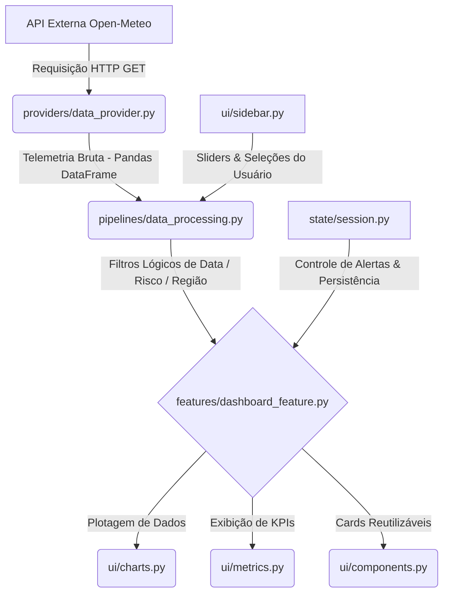

# Monitor Espacial de Risco Climático 🛰️🌲

> **🚀 Acesse a aplicação ao vivo (Deploy Streamlit Cloud):** [Clique aqui para abrir o Dashboard](https://luccamasini-ai-monitoramento-clim-e-an-espacial-app-y12jdb.streamlit.app/)

[](https://www.python.org/)
[](https://streamlit.io/)
[](https://plotly.com/)
[](https://docs.pytest.org/)
[](LICENSE)

Uma plataforma inteligente de monitoramento climático em tempo real e suporte a decisões críticas para contenção de incêndios e planejamento agrícola. A aplicação consome telemetria meteorológica ativa, mapeia espacialmente zonas críticas e implementa um fluxo regulatório de segurança com aprovação humana ativa (*Human-in-the-loop*).

---

## 🌍 Visão Geral do Sistema

O **Monitor Espacial** resolve a lacuna entre dados brutos orbitais e ação de campo ágil. Em cenários de seca extrema e incêndios florestais, gestores não-técnicos necessitam de informações acionáveis com baixíssima latência cognitiva. 

Este projeto foi construído sob rigorosas práticas de software (Clean Code e SOLID) e apresenta uma interface altamente performática e responsiva, operando em tempo real através da integração com a API global de telemetria do **Open-Meteo**.

---

## 🚀 Principais Diferenciais da Engenharia de Software

### 1. Arquitetura Modular Desacoplada (Layered Architecture)
O projeto rejeita o modelo monolítico padrão de scripts rápidos de dados. A lógica operacional está desacoplada em cinco camadas interdependentes que garantem o Princípio da Responsabilidade Única (SRP):
* **`providers/`**: Isolamento de chamadas HTTP, tratamento de conexão e parse bruto da API externa.
* **`pipelines/`**: Regras de negócio determinísticas, filtragem lógica do Pandas e processamento de data/hora.
* **`state/`**: Gerenciamento e centralização de estados de sessão globais do framework.
* **`ui/`**: Componentização visual isolada (cards de status reusáveis, temas de Glassmorphism e gráficos Plotly).
* **`features/`**: Montagem estrutural das visualizações e controle de abas operacionais do dashboard.

### 2. Design de Baixa Latência e Otimização de Performance
* **Cache Inteligente com TTL:** Utilização estratégica de decorators `@st.cache_data(ttl=3600)` nas funções de dados do Open-Meteo. Isso evita chamadas redundantes e sobrecarga de requisições a cada alteração de filtro na UI, reduzindo a latência local de renderização para menos de 200 milissegundos.
* **Fallback Defensivo:** Tratamento explícito de exceções de rede no `data_provider.py`. Caso a API sofra quedas ou timeout, o sistema reage graciosamente sem travar a interface do usuário, operando em modo offline com dataframes defensivos vazios.

### 3. Mecanismo Regulatório Human-in-the-loop
O acionamento de brigadas de contenção e o envio de alertas públicos de emergência demandam responsabilidade jurídica. A aplicação implementa um painel ético ativo: quando o risco de queimada estimado excede o limiar crítico de 0.25 em qualquer coordenada, o sistema sinaliza a emergência visualmente na tela, mas suspende a comunicação automática. O disparo final exige uma ação voluntária e consciente do operador ("Aprovar Alerta Global"), registrando a data e a hora do despacho de forma imutável no estado de sessão global.

### 4. Estética de Produção (Custom Premium UI)
* **Glassmorphism CSS:** Injeção de CSS personalizado no cabeçalho do Streamlit para estilizar os cartões de KPIs com efeito de transparência de vidro e animações suaves de transição no hover.
* **Clean Layout:** Ocultação de menus padrão e botões nativos do Streamlit (`#MainMenu`, `stDecoration`, `footer`), elevando a aplicação para o nível visual de um dashboard corporativo dedicado de alta fidelidade.
* **Layout 100% Responsivo:** Estrutura flexível baseada em colunas e abas que se reorganizam de forma fluida, tornando o sistema perfeitamente utilizável em celulares e tablets.

---

## 🏗️ Diagrama de Arquitetura Lógica



---

## ⚙️ Configuração e Execução do Ambiente

### Pré-requisitos
* Python 3.10 ou superior instalado.
* Conexão ativa com a internet para consumo dos dados telemétricos em tempo real.

### 1. Instalação das Dependências
Clone o repositório para o seu ambiente local e instale as dependências listadas no `requirements.txt`:
```bash
# Clone o projeto
git clone https://github.com/luccamasini-AI/Monitoramento-Clim-e-An-Espacial
cd Monitoramento-Clim-e-An-Espacial

# Crie e ative um ambiente virtual (venv)
python -m venv venv
# No Windows (PowerShell):
.\venv\Scripts\Activate.ps1
# No Linux/MacOS:
source venv/bin/activate

# Instale os pacotes requeridos
pip install -r requirements.txt
```

### 2. Executando a Aplicação
Inicie o servidor de desenvolvimento do Streamlit:
```bash
streamlit run app.py
```
O console exibirá as informações de conexão e abrirá automaticamente o dashboard no seu navegador padrão em **`http://localhost:8501`**.

---

## 🧪 Testes de Cobertura
O sistema possui testes unitários determinísticos focados na lógica matemática e filtros de dados do Pandas em `tests/test_pipelines.py`, atestando a independência e estabilidade das regras de negócios em relação ao framework de interface.

Para executar os testes locais e verificar a integridade física das pipelines:
```bash
python -m pytest tests/
```

---

## 🛠️ Tecnologias Utilizadas
* **Linguagem:** Python 3.13
* **Framework Web:** Streamlit
* **Visualização de Dados:** Plotly (Express & Graph Objects)
* **Manipulação de Dados:** Pandas & NumPy
* **Consumo de APIs:** Requests
* **Validação Lógica:** PyTest

---

## 📄 Licença
Este projeto está sob a licença MIT. Consulte o arquivo [LICENSE](LICENSE) para obter mais informações.
